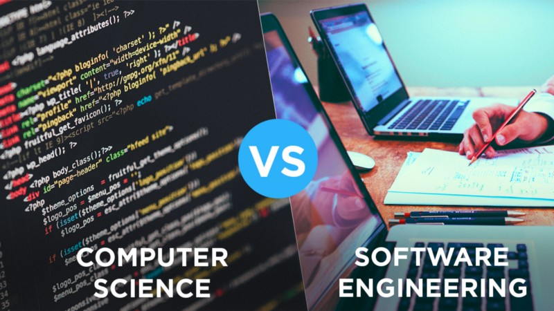
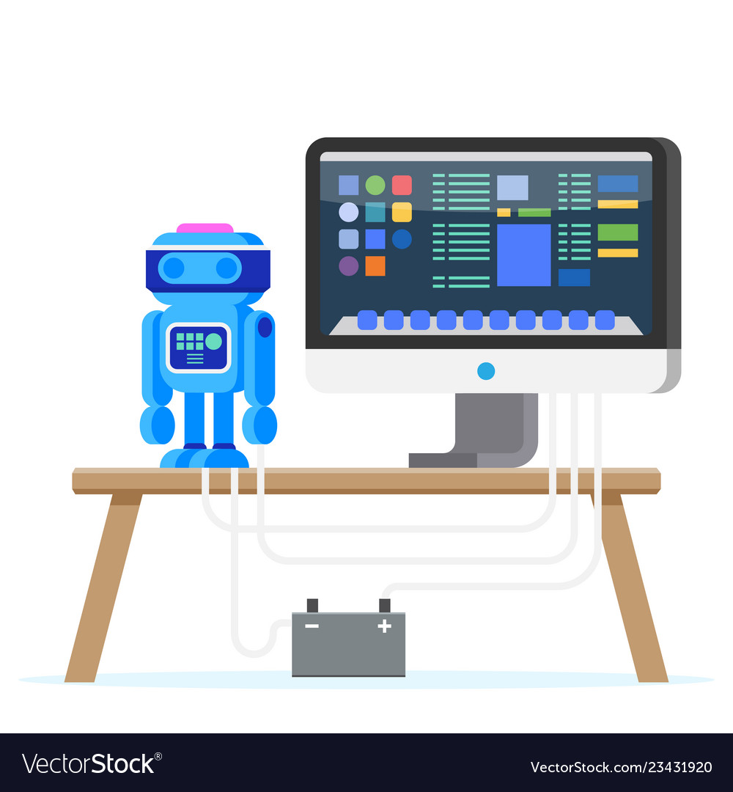

## A Foundation For Every Discipline

Initially, I always thought that software engineering was specifically for those who wanted to go into web design and so I was never really interested. But when I became an ICS student and started looking at the various niches in computer science, I noticed that software engineering was present in all of them. It is a baseline for a lot of these branches as it is needed for a lot of program designing and maintanence. Although they are categorized as two different majors, they have so much in common so the things that I learn from software engineering will apply to computer science. 

## Stepping Stones into Software Engineering

My interests in programming and software design started when I joined the robotics team as a highschool freshman. We had two teams: a hardware and a software team and since I liked hands-on work more, I joined the hardware team. But as the year went on, the software team needed more people to help out since there was only two people at the time and so I ended up being in both teams. Initially it was tough as I had zero knowledge of coding, but with the help of our instructor and the those two, I learned a good amount of python and software management. Through these experiences, I got more interested into software than hardware, which ultimately is the reason why I became an ICS student. Now, I realized the ways that we approached programming for the robot has a lot to do with software engineering, as we were using code to solve various tasks that our robot needed to do. I want to enhance those skills that I acquired in Robotics and gain more skills as well in this class.

## "Securing" Tools For My Goals

Cybersecurity was always an interest I had before becoming an ICS major. Ever since I heard about the Dark Web and how dangerous the internet can be, it made me want to find ways to keep myself protected from all the possible threats. I'm also a person who also likes playing video games such as Destiny and Overwatch, and there were many times in my life where I got hacked because the security protocols of many of these games are quite lackluster. So one thing that I really wanted to do was learn about is how hackers use viruses and other means to break into security systems. With the skills I aqcuire from software engineering, I want to become very proficient in coding and problem solving so that I can design security protocols for hackers and viruses in video games. In the future, I would want to be hired by Blizzard or some other big gaming company so I can work on the cybersecurity branch; designing and improving their protection software so that everyone can game with peace of mind.

