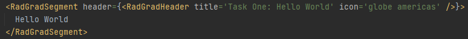
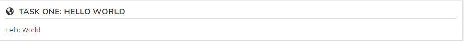
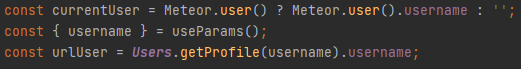
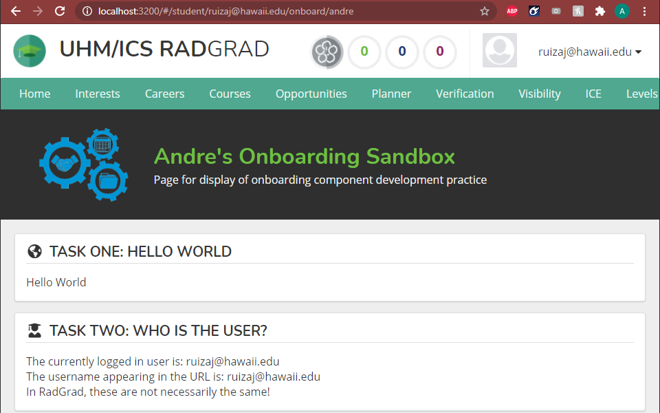
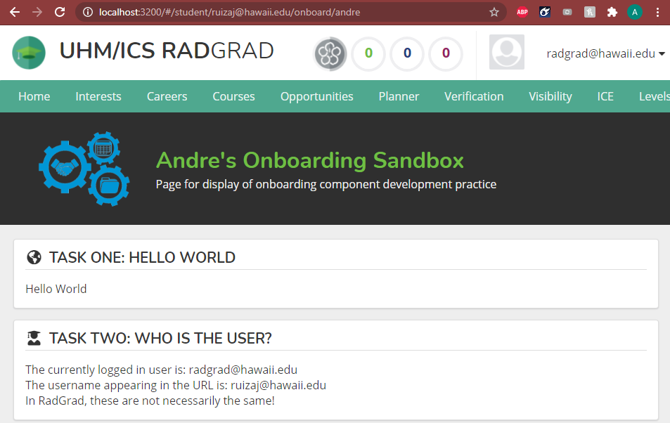
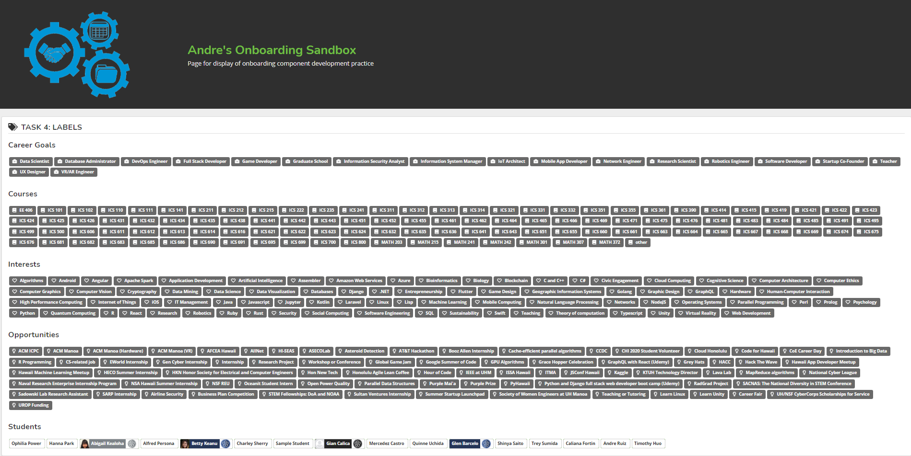
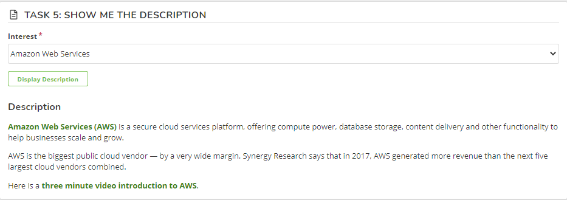
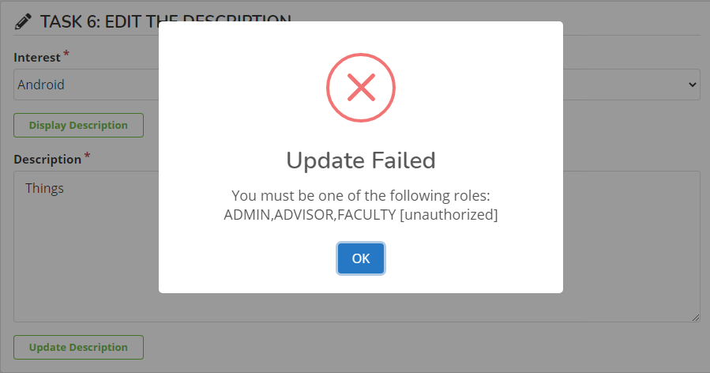
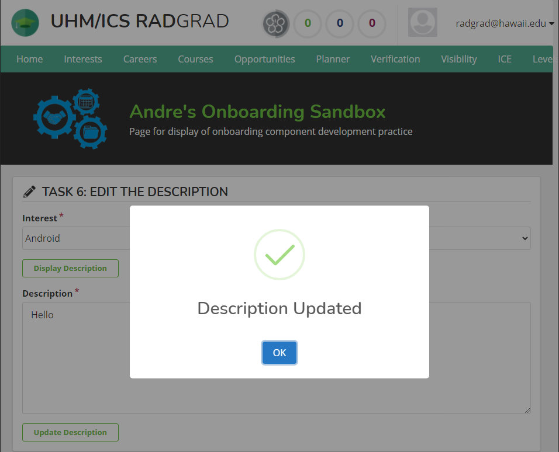
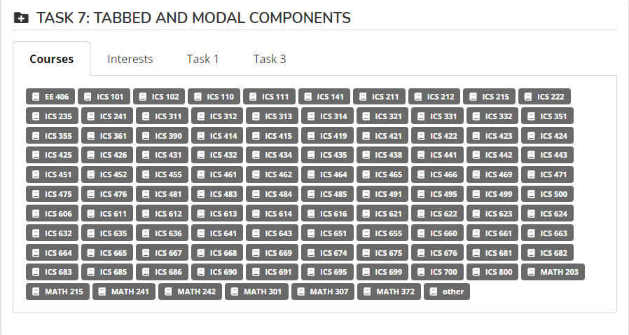

RadGrad's coding environment feels quite similar, but very different in many areas compared to InternAloha's coding environment. These tasks are problems that I'm aware of, but are handled in a way I'm unfamiliar with, which makes the experience much more fun.

## Task 1
This task is the standard starter problem for most ICS students, but the approach is something quite new to me. The PageLayout and RadGradSegment components remind me of Semantic UI's but with adding style and other elements as consts. It's also great that typescript forces the code to be exactly how it is intended.



This is how the task resulted as:



## Task 2
This task has a segment that displays the user who is looking at this sandbox page as well as the user who created this page. The difficulty for me was understanding how to display grab a user from the router URL path. After doing a bit of searching, I realized that you can grab parameters of the URL with ```useParams()```. With the username from the URL, I matched it within the Profiles collection to find the username. So I ultimately grabbed the username from the URL, and displayed it within the segment. Then I defined current user name using Meteor. This was my solution:



This is when the same user navigates to my sandbox:



This is when a different user uses the same URL path:



## Task 3
Task 3 has us add a random career card everytime you reload the page. This one stumped me because my preconceived idea to approach this problem was using ```<Card.Group>``` and mapping a random singular card since I assumed that the career data within the career goals tab used a similar method to display it's pages. After talking to a few members, I decided to create the data from scratch by importing data from the careerGoals collection. Getting the length was simple enough, but mapping random career data proved a little difficult. After searching the Markdown usage and looking at the parameters of careerGoal, I modified the segment to show random items. 


## Task 4
Task 4 has us now add labels to a segment connected our name so that if a tag is in our profile, it will highlight. This problem is much easier after finishing Task 3 as it uses the same concept of importing collections withTracker and adding them to an interface the component will use. The only problem I had was understanding what slugs were at first, but besides that, it was a good refresher on mapping items with their unique id's and displaying them. Another small thing that I wasn't aware of at first was there were more students than in the example page, which was attributed to changing ```.findNonReried();``` to ```.find({ isAlumni: false }).fetch()``` in order to fix it.



## Task 5
Task 5 is to add a submit form that chooses an interest and displays it on submission using Uniform. This task was a huge refresher since I haven't dabbled with schemas since 314, but InternAloha helped with understanding the forms initially. Using AddInterestForm.tsx as a reference, I created a schema implementing the Interest collection. I then created the segment like the other tasks, while adding an AutoForm that uses a SelectField and a SubmitField. Then I made an ```onSubmit()``` function which updates the description on button submission. All I needed to do after was use Markdown from earlier tasks and uses the descrition as its source.



## Task 6
Task 6 was a continuation of task 5 in the sense that instead of displaying descriptions, we create a form on submit to be able to edit the descriptions instead. This one wasn't too difficult a task, but I did use EditStudentButton.tsx for inspiration on the swal submit usage. This new submit form impends the new description onto the respective ```._id``` of the Interest in the collection.

Trying to edit the description on a student account will fail due to lack of admin privileges.



But editing on the RadGrad account allows the edit to go through.



## Task 7
The last task was pretty great as it is creatively testing out the tabs and modals within our RadGrad sandbox. As this is something that I have done with InternAloha before, it isn't too much of an issue, but trying these components with this new coding style is quite nice. One of the ideas that Cam suggested was adding a modal within a tab, so I tested that idea out by creating Task 1 and 3 tabs. I also added tabs that calls course and interest labels just to test out the tab functionality. Overall this was a nice exercise to top off the entire sandboxing exercise.




After clicking on the button within Task 3's tab, the modal pops up:


