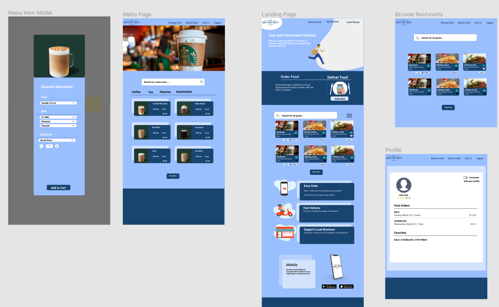

Ono On-The-Way was a website application that my team and I worked on as our final project for ICS 314, Software Engineering. In a sense Ono OTW works like most online food delivery services like Uber Eats or Postmates, but on directed towards a University of Manoa audience. Our goal for this project was a localized delivery service that is fast and reliable, but also helps to support local businesses around the campus. At first glance, our website seems like any other food delivery service, but with the added option to be either a buyer or a deliverer. What this means is that if you have the time, even you can deliver food to other students for a bit of money. 

This allows people to skip the need of signing up for a special contract like a normal contract, meaning anyone can be a deliverer if they want. These two entities of buying and delivering can be accessed on the same account, so ease of access is streamlined. Additionally, you can rate food that you like on a 5-star system so you don't need to check of Yelp or other review services to see if certain food is good or not.

For this project, we started off with a plethora of mock ups that my team worked together to make individually. After we agreed upon the overall design and functions, we got to work. 

For the user interface, I worked on various frontend and backend portions. I worked on the sign up page for inputting user information and modified the navbar a little bit. I also worked on the cart page system with my teammate Jenny so that the website can process the pricing totals for buying items (this included calculating taxes and adding deletion methods for individual items). In terms of backend, I worked on the MongoDB collections for the cart and a little bit of the menu items so that we can test if our cart page actually worked. Once most of the project was finished, I helped with small improvements to functionality as well as making adding forms so that admins can add new restaurants. 

Overall, this project was such a great learning opportunity to test out all the knowledge that we accumulated in ICS 314. It really helped me understand interface design and databases in a broader sense. There were times where it took hours to figure out code that can be solved within minutes, but that is just part of the learning experience through trial and error. But most of all, this project tested my teamwork skills and time management. Because we are in the middle of this COVID-19 quarantine, it is difficult to meet my teammates to work on this project, so setting up time to meet through our Ono-OTW Discord and different methods became paramount to keep us on track. I came into this class with almost zero experience in website design and database management, and I came out with quite an amazing website that I'm very proud of. This project brought a newfound respect for website developers and created a new interest in software engineering that I never had before. 

